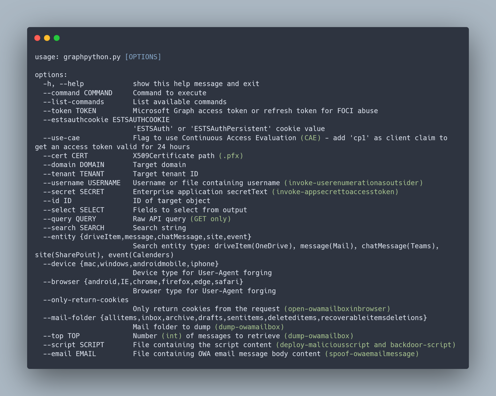

# Graphpython

<p align="center">
  
</p>

Graphpython is a modular Python tool for cross-platform Microsoft Graph API enumeration and exploitation. It builds upon the capabilities of AADInternals (Killchain.ps1), GraphRunner, and TokenTactics(V2) to provide a comprehensive solution for interacting with the Microsoft Graph API for red team and cloud assumed breach operations. 

Graphpython covers external reconnaissance, authentication/token manipulation, enumeration, and post-exploitation of various Microsoft services, including Entra ID (Azure AD), Office 365 (Outlook, SharePoint, OneDrive, Teams), and Intune (Endpoint Management).

## Index

- [Installation](#Installation)
- [Usage](#Usage)
- [Commands](#Commands)
- [Demos](#Demos)
 
## Installation

Graphpython is designed to be cross-platform, ensuring compatibility with both Windows and Linux based operating systems:

```
git clone https://github.com/mlcsec/Graphpython.git
cd Graphpython
pip install .
```
```bash
Graphpython -h
# or
python3 Graphpython.py -h
```

## Usage

<p align="center">
  
</p>

## Commands

Please refer to the [Wiki](https://github.com/mlcsec/Graphpython/wiki) for more details on the available functionality:

### Outsider

- Invoke-ReconAsOutsider
- Invoke-UserEnumerationAsOutsider

### Authentication

- Get-GraphTokens
- Get-TenantID
- Get-TokenScope
- Decode-AccessToken
- Invoke-RefreshToMSGraphToken
- Invoke-RefreshToAzureManagementToken
- Invoke-RefreshToVaultToken
- Invoke-RefreshToMSTeamsToken
- Invoke-RefreshToOfficeAppsToken
- Invoke-RefreshToOfficeManagementToken
- Invoke-RefreshToOutlookToken
- Invoke-RefreshToSubstrateToken
- Invoke-RefreshToYammerToken
- Invoke-RefreshToIntuneEnrollmentToken
- Invoke-RefreshToOneDriveToken
- Invoke-RefreshToSharePointToken
- Invoke-CertToAccessToken
- Invoke-ESTSCookieToAccessToken
- Invoke-AppSecretToAccessToken
- New-SignedJWT

### Post-Auth Enumeration

- Get-CurrentUser
- Get-CurrentUserActivity
- Get-OrgInfo
- Get-Domains
- Get-User
- Get-UserProperties
- Get-UserGroupMembership
- Get-UserTransitiveGroupMembership
- Get-Group
- Get-GroupMember
- Get-AppRoleAssignments
- Get-ConditionalAccessPolicy
- Get-Application
- Get-AppServicePrincipal
- Get-ServicePrincipal
- Get-ServicePrincipalAppRoleAssignments
- Get-PersonalContacts
- Get-CrossTenantAccessPolicy
- Get-PartnerCrossTenantAccessPolicy
- Get-UserChatMessages
- Get-AdministrativeUnitMember
- Get-OneDriveFiles
- Get-UserPermissionGrants
- Get-oauth2PermissionGrants
- Get-Messages
- Get-TemporaryAccessPassword
- Get-Password
- List-AuthMethods
- List-DirectoryRoles
- List-Notebooks
- List-ConditionalAccessPolicies
- List-ConditionalAuthenticationContexts
- List-ConditionalNamedLocations
- List-SharePointRoot
- List-SharePointSites
- List-SharePointURLs
- List-ExternalConnections
- List-Applications
- List-ServicePrincipals
- List-Tenants
- List-JoinedTeams
- List-Chats
- List-ChatMessages
- List-Devices
- List-AdministrativeUnits
- List-OneDrives
- List-RecentOneDriveFiles
- List-SharedOneDriveFiles
- List-OneDriveURLs

### Post-Auth Exploitation

- Invoke-CustomQuery
- Invoke-Search
- Find-PrivilegedRoleUsers
- Find-PrivilegedApplications
- Find-UpdatableGroups
- Find-SecurityGroups
- Find-DynamicGroups
- Update-UserPassword
- Update-UserProperties
- Add-UserTAP
- Add-GroupMember
- Add-ApplicationPassword
- Add-ApplicationCertificate
- Add-ApplicationPermission
- Grant-AppAdminConsent
- Create-Application
- Create-NewUser
- Invite-GuestUser
- Assign-PrivilegedRole
- Open-OWAMailboxInBrowser
- Dump-OWAMailbox
- Spoof-OWAEmailMessage

### Post-Auth Intune Enumeration

- Get-ManagedDevices
- Get-UserDevices
- Get-CAPs
- Get-DeviceCategories
- Get-DeviceComplianceSummary
- Get-DeviceConfigurations
- Get-DeviceConfigurationPolicySettings
- Get-DeviceEnrollmentConfigurations
- Get-DeviceGroupPolicyConfigurations
- Get-DeviceGroupPolicyDefinition
- Get-RoleDefinitions
- Get-RoleAssignments
- Get-DeviceCompliancePolicies
- Get-DeviceConfigurationPolicies

### Post-Auth Intune Exploitation

- Dump-DeviceManagementScripts
- Dump-WindowsApps
- Dump-iOSApps
- Dump-macOSApps
- Dump-AndroidApps
- Get-ScriptContent
- Backdoor-Script
- Deploy-MaliciousScript
- Deploy-MaliciousWebLink
- Display-AVPolicyRules
- Display-ASRPolicyRules
- Display-DiskEncryptionPolicyRules
- Display-FirewallConfigPolicyRules
- Display-FirewallRulePolicyRules
- Display-EDRPolicyRules
- Display-LAPSAccountProtectionPolicyRules
- Display-UserGroupAccountProtectionPolicyRules
- Add-ExclusionGroupToPolicy
- Reboot-Device
- Lock-Device
- Shutdown-Device
- Update-DeviceConfig

### Cleanup

- Delete-User
- Delete-Group
- Remove-GroupMember
- Delete-Application
- Delete-Device
- Wipe-Device
- Retire-Device

### Locators

- Locate-ObjectID
- Locate-PermissionID

<br>

# Demos

The following demos can be found on the [Wiki](https://github.com/mlcsec/Graphpython/wiki/Demos):

- [Outsider](https://github.com/mlcsec/Graphpython/wiki/Demos#outsider)
    - [Invoke-ReconAsOutsider](https://github.com/mlcsec/Graphpython/wiki/Demos#invoke-reconasoutsider)
    - [Invoke-UserEnumerationAsOutsider](https://github.com/mlcsec/Graphpython/wiki/Demos#invoke-userenumerationasoutsider)
- [Authentication](https://github.com/mlcsec/Graphpython/wiki/Demos#authentication)
    - [Get-GraphTokens](https://github.com/mlcsec/Graphpython/wiki/Demos#get-graphtokens)
    - [Get-TenantID](https://github.com/mlcsec/Graphpython/wiki/Demos#get-tenantid)
    - [Invoke-RefreshToAzureManagementToken](https://github.com/mlcsec/Graphpython/wiki/Demos#invoke-refreshtoazuremanagementtoken)
    - [Invoke-RefreshToMSGraphToken](https://github.com/mlcsec/Graphpython/wiki/Demos#invoke-refreshtomsgraphtoken)
    - [Invoke-CertToAccessToken](https://github.com/mlcsec/Graphpython/wiki/Demos#invoke-certtoaccesstoken)
    - [Invoke-ESTSCookieToAccessToken](https://github.com/mlcsec/Graphpython/wiki/Demos#invoke-estscookietoaccesstoken)
- [Post-Auth Enumeration](https://github.com/mlcsec/Graphpython/wiki/Demos#post-auth-enumeration)    
    - [Get-CurrentUser](https://github.com/mlcsec/Graphpython/wiki/Demos#get-currentuser)
    - [Get-User](https://github.com/mlcsec/Graphpython/wiki/Demos#get-user)
    - [Get-Group](https://github.com/mlcsec/Graphpython/wiki/Demos#get-group)
    - [Get-UserPrivileges](https://github.com/mlcsec/Graphpython/wiki/Demos#get-userprivileges)
    - [Get-Domains](https://github.com/mlcsec/Graphpython/wiki/Demos#get-domains)
    - [Get-Application](https://github.com/mlcsec/Graphpython/wiki/Demos#get-application)
    - [List-RecentOneDriveFiles](https://github.com/mlcsec/Graphpython/wiki/Demos#list-recentonedrivefiles)
- [Post-Auth Exploitation](https://github.com/mlcsec/Graphpython/wiki/Demos#post-auth-exploitation)    
    - [Invite-GuestUser](https://github.com/mlcsec/Graphpython/wiki/Demos#invite-guestuser)
    - [Find-PrivilegedRoleUsers](https://github.com/mlcsec/Graphpython/wiki/Demos#find-privilegedroleusers)
    - [Assign-PrivilegedRole](https://github.com/mlcsec/Graphpython/wiki/Demos#assign-privilegedrole)
    - [Find-PrivilegedApplications](https://github.com/mlcsec/Graphpython/wiki/Demos#find-privilegedapplications)
    - [Add-ApplicationCertificate](https://github.com/mlcsec/Graphpython/wiki/Demos#add-applicationcertificate)
    - [Add-ApplicationPermission](https://github.com/mlcsec/Graphpython/wiki/Demos#add-applicationpermission)
    - [Spoof-OWAEmailMessage](https://github.com/mlcsec/Graphpython/wiki/Demos#spoof-owaemailmessage)
    - [Find-DynamicGroups](https://github.com/mlcsec/Graphpython/wiki/Demos#find-dynamicgroups)
    - [Find-UpdatableGroups](https://github.com/mlcsec/Graphpython/wiki/Demos#find-updatablegroups)
    - [Invoke-Search](https://github.com/mlcsec/Graphpython/wiki/Demos#invoke-search)
- [Post-Auth Intune Enumeration](https://github.com/mlcsec/Graphpython/wiki/Demos#post-auth-intune-enumeration)
    - [Get-ManagedDevices](https://github.com/mlcsec/Graphpython/wiki/Demos#get-manageddevices)
    - [Get-UserDevices](https://github.com/mlcsec/Graphpython/wiki/Demos#get-userdevices) 
    - [Get-DeviceCompliancePolicies](https://github.com/mlcsec/Graphpython/wiki/Demos#get-devicecompliancepolicies)
    - [Get-DeviceConfigurationPolicies](https://github.com/mlcsec/Graphpython/wiki/Demos#get-deviceconfigurationpolicies)
- [Post-Auth Intune Exploitation](https://github.com/mlcsec/Graphpython/wiki/Demos#post-auth-intune-exploitation)
    - [Display-AVPolicyRules](https://github.com/mlcsec/Graphpython/wiki/Demos#display-avpolicyrules)
    - [Get-ScriptContent](https://github.com/mlcsec/Graphpython/wiki/Demos#get-scriptcontent)
    - [Backdoor-Script](https://github.com/mlcsec/Graphpython/wiki/Demos#backdoor-script)
    - [Deploy-MaliciousScript](https://github.com/mlcsec/Graphpython/wiki/Demos#deploy-maliciousscript)
    - [Deploy-MaliciousWebLink](https://github.com/mlcsec/Graphpython/wiki/Demos#deploy-maliciousweblink)
    - [Add-ExclusionGroupToPolicy](https://github.com/mlcsec/Graphpython/wiki/Demos#add-exclusiongrouptopolicy)
- [Cleanup](https://github.com/mlcsec/Graphpython/wiki/Demos#cleanup)
    - [Remove-GroupMember](https://github.com/mlcsec/Graphpython/wiki/Demos#remove-groupmember)
- [Locators](https://github.com/mlcsec/Graphpython/wiki/Demos#locators)
    - [Locate-ObjectID](https://github.com/mlcsec/Graphpython/wiki/Demos#locate-objectid)
    - [Locate-PermissionID](https://github.com/mlcsec/Graphpython/wiki/Demos#locate-permissionid)
  
<br>

## Acknowledgements and References

- [AADInternals](https://github.com/Gerenios/AADInternals)
- [GraphRunner](https://github.com/dafthack/GraphRunner)
- [TokenTactics](https://github.com/rvrsh3ll/TokenTactics) and [TokenTacticsV2](https://github.com/f-bader/TokenTacticsV2)
- [https://learn.microsoft.com/en-us/graph/permissions-reference](https://learn.microsoft.com/en-us/graph/permissions-reference)
- [https://learn.microsoft.com/en-us/entra/identity/role-based-access-control/permissions-reference](https://learn.microsoft.com/en-us/entra/identity/role-based-access-control/permissions-reference)
- [https://graphpermissions.merill.net/](https://graphpermissions.merill.net/)
  
<br>

## Todo

- Update:
  - [ ] `Get-UserPrivileges` - update to flag any privileged directory role app ids green
  - [ ] `Locate-DirectoryRoleID` - similar to other locator functions but for resolving directory role ids
  - [ ] `Deploy-MaliciousWebLink` - add option to deploy script which copies link new link to all user desktops
- New:
  - [ ] `Deploy-MaliciousWin32Exe/MSI` - use IntuneWinAppUtil.exe to package the EXE/MSI and deploy to devices
    - check also [here](https://learn.microsoft.com/en-us/graph/api/resources/intune-app-conceptual?view=graph-rest-1.0) for managing iOS, Android, LOB apps etc. via graph
  - [ ] `Update/Deploy-Policy` - update existing rules for av, asr, etc. policy or deploy a new one with specific groups/devices
  - [ ] `Invoke-MFASweep` - port mfa sweep and add to outsider commands
  - [ ] `Invoke-AADIntReconAsGuest` and `Invoke-AADIntUserEnumerationAsGuest` - port from AADInternals 
- Options:
  - [ ] --proxy option
