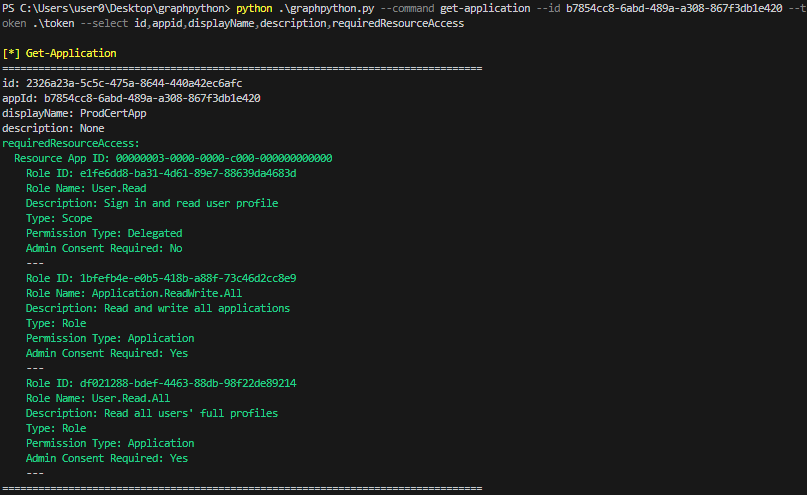
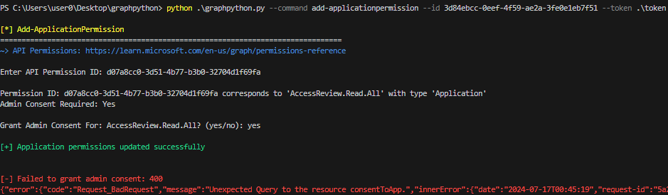
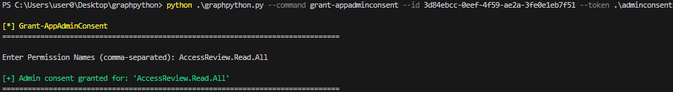
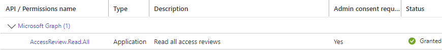
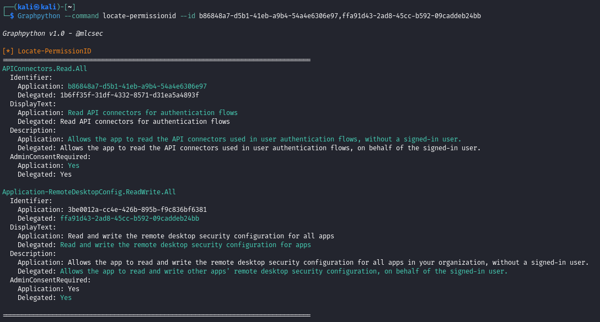
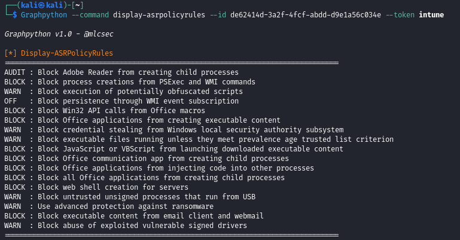
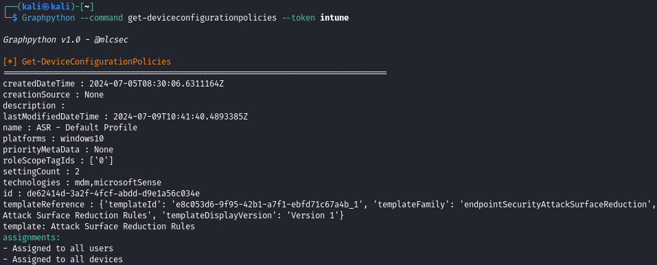
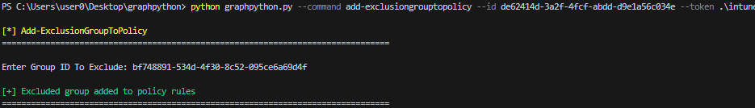
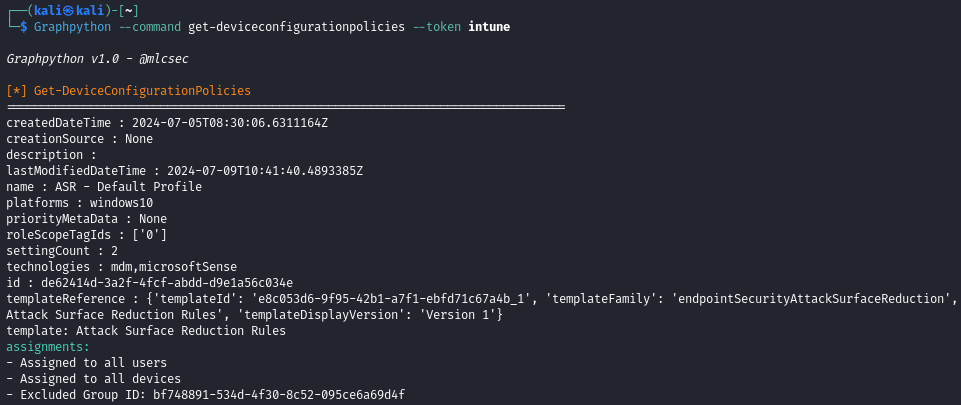

# Graphpython

<p align="center">
  
</p>

Graphpython is a modular Python tool for cross-platform Microsoft Graph API enumeration and exploitation. It builds upon the capabilities of AADInternals (Killchain.ps1), GraphRunner, and TokenTactics(V2) to provide a comprehensive solution for interacting with the Microsoft Graph API for red team and cloud assumed breach operations. 

Graphpython covers external reconnaissance, authentication/token manipulation, enumeration, and post-exploitation of various Microsoft services, including Entra ID (Azure AD), Office 365 (Outlook, SharePoint, OneDrive, Teams), and Intune (Endpoint Management).

## Index

- [Install](#Install)
- [Usage](#Usage)
- [Commands](#Commands)
- [Demo](#demos)
  - [Outsider](#outsider-1)
      - [Invoke-ReconAsOutsider](#invoke-reconasoutsider)
      - [Invoke-UserEnumerationAsOutsider](#invoke-userenumerationasoutsider)
  - [Authentication](#authentication-1)
      - [Get-GraphTokens](#get-graphtokens)
      - [Invoke-RefreshToAzureManagementToken](#invoke-refreshtoazuremanagementtoken)
      - [Invoke-CertToAccessToken](#invoke-certtoaccesstoken)
      - [Invoke-ESTSCookieToAccessToken](#invoke-estscookietoaccesstoken)
  - [Post-Auth Enumeration](#post-auth-enumeration-1)    
      - [Get-User](#get-user)
      - [Get-UserPrivileges](#get-userprivileges)
      - [Get-Application](#get-application)
      - [List-RecentOneDriveFiles](#list-recentonedrivefiles)
  - [Post-Auth Exploitation](#post-auth-exploitation-1)    
      - [Invite-GuestUser](#invite-guestuser)
      - [Find-PrivilegedRoleUsers](#find-privilegedroleusers)
      - [Assign-PrivilegedRole](#assign-privilegedrole)
      - [Find-PrivilegedApplications](#find-privilegedapplications)
      - [Add-ApplicationPermission](#add-applicationpermission)
      - [Spoof-OWAEmailMessage](#spoof-owaemailmessage)
      - [Find-DynamicGroups](#find-dynamicgroups)
      - [Find-UpdatableGroups](#find-updatablegroups)
  - [Post-Auth Intune Enumeration](#post-auth-intune-enumeration-1)
      - [Get-ManagedDevices](#get-manageddevices)
      - [Get-UserDevices](#get-userdevices) 
      - [Get-DeviceConfigurationPolicies](#get-deviceconfigurationpolicies)
  - [Post-Auth Intune Exploitation](#post-auth-intune-exploitation-1)
      - [Display-AVPolicyRules](#display-avpolicyrules)
      - [Get-ScriptContent](#get-scriptcontent)
      - [Backdoor-Script](#backdoor-script)
      - [Deploy-MaliciousScript](#deploy-maliciousscript)
      - [Add-ExclusionGroupToPolicy](#add-exclusiongrouptopolicy)
  - [Cleanup](#cleanup-1)
      - [Remove-GroupMember](#remove-groupmember)
  - [Locators](#locators-1)
      - [Locate-ObjectID](#locate-objectid)
      - [Locate-PermissionID](#locate-permissionid)


## Install

Install via git and pip:
```
git clone https://github.com/mlcsec/Graphpython.git
cd Graphpython
pip install .
Graphpython -h
```
Or run manually with Python3:
```
git clone https://github.com/mlcsec/Graphpython.git
cd Graphpython
pip3 install -r requirements.txt
python3 Graphpython.py -h
```

## Usage

<p align="center">
  
</p>

## Commands

Please refer to the [Wiki](https://github.com/mlcsec/Graphpython/wiki) for more details on the available functionality.

### Outsider

- Invoke-ReconAsOutsider
- Invoke-UserEnumerationAsOutsider

### Authentication

- Get-GraphTokens
- Get-TenantID
- Get-TokenScope
- Decode-AccessToken
- Invoke-RefreshToMSGraphToken
- Invoke-RefreshToAzureManagementToken
- Invoke-RefreshToVaultToken
- Invoke-RefreshToMSTeamsToken
- Invoke-RefreshToOfficeAppsToken
- Invoke-RefreshToOfficeManagementToken
- Invoke-RefreshToOutlookToken
- Invoke-RefreshToSubstrateToken
- Invoke-RefreshToYammerToken
- Invoke-RefreshToIntuneEnrollmentToken
- Invoke-RefreshToOneDriveToken
- Invoke-RefreshToSharePointToken
- Invoke-CertToAccessToken
- Invoke-ESTSCookieToAccessToken
- Invoke-AppSecretToAccessToken
- New-SignedJWT

### Post-Auth Enumeration

- Get-CurrentUser
- Get-CurrentUserActivity
- Get-OrgInfo
- Get-Domains
- Get-User
- Get-UserProperties
- Get-UserGroupMembership
- Get-UserTransitiveGroupMembership
- Get-Group
- Get-GroupMember
- Get-AppRoleAssignments
- Get-ConditionalAccessPolicy
- Get-Application
- Get-AppServicePrincipal
- Get-ServicePrincipal
- Get-ServicePrincipalAppRoleAssignments
- Get-PersonalContacts
- Get-CrossTenantAccessPolicy
- Get-PartnerCrossTenantAccessPolicy
- Get-UserChatMessages
- Get-AdministrativeUnitMember
- Get-OneDriveFiles
- Get-UserPermissionGrants
- Get-oauth2PermissionGrants
- Get-Messages
- Get-TemporaryAccessPassword
- Get-Password
- List-AuthMethods
- List-DirectoryRoles
- List-Notebooks
- List-ConditionalAccessPolicies
- List-ConditionalAuthenticationContexts
- List-ConditionalNamedLocations
- List-SharePointRoot
- List-SharePointSites
- List-SharePointURLs
- List-ExternalConnections
- List-Applications
- List-ServicePrincipals
- List-Tenants
- List-JoinedTeams
- List-Chats
- List-ChatMessages
- List-Devices
- List-AdministrativeUnits
- List-OneDrives
- List-RecentOneDriveFiles
- List-SharedOneDriveFiles
- List-OneDriveURLs

### Post-Auth Exploitation

- Invoke-CustomQuery
- Invoke-Search
- Find-PrivilegedRoleUsers
- Find-PrivilegedApplications
- Find-UpdatableGroups
- Find-SecurityGroups
- Find-DynamicGroups
- Update-UserPassword
- Update-UserProperties
- Add-UserTAP
- Add-GroupMember
- Add-ApplicationPassword
- Add-ApplicationCertificate
- Add-ApplicationPermission
- Grant-AppAdminConsent
- Create-Application
- Create-NewUser
- Invite-GuestUser
- Assign-PrivilegedRole
- Open-OWAMailboxInBrowser
- Dump-OWAMailbox
- Spoof-OWAEmailMessage

### Post-Auth Intune Enumeration

- Get-ManagedDevices
- Get-UserDevices
- Get-CAPs
- Get-DeviceCategories
- Get-DeviceComplianceSummary
- Get-DeviceConfigurations
- Get-DeviceConfigurationPolicySettings
- Get-DeviceEnrollmentConfigurations
- Get-DeviceGroupPolicyConfigurations
- Get-DeviceGroupPolicyDefinition
- Get-RoleDefinitions
- Get-RoleAssignments
- Get-DeviceCompliancePolicies
- Get-DeviceConfigurationPolicies

### Post-Auth Intune Exploitation

- Dump-DeviceManagementScripts
- Dump-WindowsApps
- Dump-iOSApps
- Dump-macOSApps
- Dump-AndroidApps
- Get-ScriptContent
- Backdoor-Script
- Deploy-MaliciousScript
- Display-AVPolicyRules
- Display-ASRPolicyRules
- Display-DiskEncryptionPolicyRules
- Display-FirewallConfigPolicyRules
- Display-FirewallRulePolicyRules
- Display-EDRPolicyRules
- Display-LAPSAccountProtectionPolicyRules
- Display-UserGroupAccountProtectionPolicyRules
- Add-ExclusionGroupToPolicy
- Reboot-Device
- Retire-Device
- Lock-Device
- Shutdown-Device
- Update-DeviceConfig

### Cleanup

- Delete-User
- Delete-Group
- Remove-GroupMember
- Delete-Application
- Delete-Device
- Wipe-Device

### Locators

- Locate-ObjectID
- Locate-PermissionID

<br>

# Demo

## Outsider

### Invoke-ReconAsOutsider

Perform unauthenticated external recon of the target domain like AADInternal's [Invoke-ReconAsOutsider](https://github.com/Gerenios/AADInternals/blob/master/KillChain.ps1#L8)

#### Example:
```
# graphpython.py --command invoke-reconasoutsider --domain company.com
```
#### Output:
```
[*] Invoke-ReconAsOutsider
================================================================================
Domains: 2
Tenant brand:       Company Ltd
Tenant name:        company
Tenant id:          05aea22e-32f3-4c35-831b-52735704feb3
Tenant region:      EU
DesktopSSO enabled: False
MDI instance:       Not found
Uses cloud sync:    False

Name                                       DNS   MX    SPF    DMARC   DKIM   MTA-STS  Type        STS
----                                       ---   ---   ----   -----   ----   -------  ----        ---
company.com                                False False False  False   False  False    Federated   sts.company.com
company.onmicrosoft.com                    True  True  True   False   True   False    Managed
================================================================================
```

### Invoke-UserEnumerationAsOutsider

Perform username enumeration for the target domain like AADInternal's [Invoke-UserEnumerationAsOutsider](https://github.com/Gerenios/AADInternals/blob/master/KillChain.ps1#L283):


<br>

## Authentication

### Get-GraphTokens

Obtain MS Graph tokens via device code authentication (can also be used for device code phishing):


### Invoke-RefreshToAzureManagementToken

A valid refresh token can be used to generate access tokens for a [variety of services](https://github.com/mlcsec/Graphpython/wiki#authentication), Azure Management for example shown below. The `--use-cae` switch can be included to use **Continuous Access Evaluation (CAE)** to obtain an access token that's valid for 24 hours:


The returned access token can then be used to authenticate to Azure via the Az PowerShell module:
```
PS > Connect-AzAccount -AccessToken eyJ0eXAi... -AccountId user@domain.onmicrosoft.com -Tenant 42838115-fbda-497e-b273-30944ff2786e

Subscription name    Tenant
-----------------    ------
Azure subscription   42838115-fbda-497e-b273-30944ff2786e
```

### Invoke-CertToAccesstoken

If you stumble across an enterprise application certificate (.pfx) you can use it to request a valid MS Graph access token. 

> The enterprise application must have the corresponding .crt, .pem, or .cer in the application's certificates & secrets configuration otherwise you'll receive 401 client errors as the .pfx used to sign the client assertion won't be registered with the application


The [Get-Application](https://github.com/mlcsec/Graphpython?tab=readme-ov-file#get-application) command can be used to identified the Graph permissions assigned to the compromised application.

### Invoke-ESTSCookieToAccessToken

Obtain an MS Graph token for a selected client (MSTeams, MSEdge, AzurePowershell) from a captured ESTSAUTH or ESTSAUTHPERSISTENT cookie:

> ESTSAUTH and ESTSAUTHPERSISTENT cookies are often captured via successful Evilginx phishes


<br>

## Post-Auth Enumeration

### Get-User

Get all or specific user(s) details. User object can be supplied as user ID or User Principal Name:


### Get-UserPrivileges

Identifies assigned directory roles, Administrative Units, and Group membership information for the current user of target user:


### Get-Application

Get details relating to the target application and now dynamically resolves the `requiredResourceAccess` attribute which contains Graph API role IDs assigned to the application:



### List-RecentOneDriveFiles

List recent OneDrive files belonging to current user:


<br>

## Post-Auth Exploitation

### Invite-GuestUser

Invite a malicious guest user to the target environment:


### Find-PrivilegedRoleUsers

Loops through 27 of the most privileged directory roles in Entra and displays any assignments to help identify high-value targets:


### Assign-PrivilegedRole

Assign a privileged role via template ID to a user or group and define permission scope:


### Find-PrivilegedApplications

Applications can be granted privileged Graph API permissions via 'Grant admin consent...' option for permissions marked 'Admin consent required':


The `Find-PrivilegedApplications` command helps to identify high-value apps that have already been assigned with privileged permssions:

1. identifies all enterprise/registered applications within Entra (no default Microsoft ones included)
2. finds the service principal ID for each application
3. enumerates app role assignments for each application service principal
4. cross-references assigned app role IDs and data against .github/graphpermissions.txt
5. displays assigned role name and description


### Add-ApplicationPermission

Adds desired Graph API permission to target application ID. If the role is privileged it will prompt the user to confirm whether to attempt to grant admin consent (via the `beta/directory/consentToApp` endpoint) using the current privileges:



> NOTE: if the admin consent grant attempt fails with 400 error the token likely doesn't have the necessary scope/permissions assigned

The permission update succeeded in this instance and the application API permission is assigned however the admin consent grant obviously failed:


Once you obtain the necessary permissions or compromise a privileged token then the `Grant-AppAdminConsent` command can be used to grant admin consent to the role that was added for the target app ID:



Verified in the Azure portal:



Or you can use the `Get-Application` command:
```
# graphpython.py --command get-application --id 3d84ebcc-0eef-4f59-ae2a-3fe0e1eb7f51 --token .\token --select requiredResourceAccess

[*] Get-Application
================================================================================
requiredResourceAccess: [{'resourceAppId': '00000003-0000-0000-c000-000000000000', 'resourceAccess': [{'id': 'd07a8cc0-3d51-4b77-b3b0-32704d1f69fa', 'type': 'Role'}]}]
================================================================================
```
The ID within `resourceAccess` corresponds to `AccessReview.Read.All` that was assigned as confirmed with [Locate-PermissionID](https://github.com/mlcsec/Graphpython/tree/main?tab=readme-ov-file#locate-permissionid):




### Spoof-OWAEmailMessage

Send emails using a compromised user's Outlook mail box. The `--id` parameter can be used to send emails as other users within the organistion.

> Mail.Send permission REQUIRED for `--id` spoofing

Options:
1. Compromise and auth as an application service principal with the `Mail.Send` permission assigned then use `Spoof-OWAEmailMessage`
2. Obtain Global Admin/Application Admin/Cloud Admin permissions or assign role to an existing owned user with `Assign-PrivilegedRole` -> then add a password/certifcate and `Mail.Send` permission to an enterprise app -> auth as the app service principal and then use `Spoof-OWAEmailMessage`


The content of `--email email.txt` for reference:

```
Morning,

Please use following login for the devops portal whilst the main app is down:

https://malicious/login

Regards,

MC 
```
> I've not tested any HTML or similar formatted emails but in theory anything that works in Outlook normally should render correctly if supplied via `--email`.

Can see the email in the target users Outlook:


### Find-DynamicGroups

Identify groups with dyanmic group membership rules that can be abused:


In this instance you could create a new user (`Create-NewUser`) with 'admin' in their UPN to be assigned to the Dynamic Admins group. Or you could update the user's Department property via `Update-UserProperties`.

### Find-UpdatableGroups

Identify groups that can be updated with the current user's permissions:


<br>

## Post-Auth Intune Enumeration

### Get-ManagedDevices

List Intune managed devices then select and display device properties such as name, os version, and username:


### Get-UserDevices

Similarly you can identify all Intune managed devices and details belonging to a specific user by supplying their Entra User ID or their User Principal Name using the `--id` flag:


### Get-DeviceConfigurationPolicies

Identify all created device configuration policies across the Intune environment with colour highlighting for policies with active/no assignments. This includes Antivirus (Defender), Disk encryption (Bitlocker), Firewall (policies and rules), EDR, and Attack Surface Reduction (ASR):


In the example above you can see an ASR policy in place which is assigned to all users and devices, however members of group ID `46a6...` are excluded. There is a Bitlocker policy but it hasn't been assigned to any devices.

<br>

## Post-Auth Intune Exploitation

### Display-AVPolicyRules

Display the rules for a Microsoft Defender Antivirus policy deployed via Intune:


### Get-ScriptContent

Get all device management PowerShell script details and content:


### Backdoor-Script

Identify a pre-existing device management script you want to add malicious code to and get it's content:


Create a new script locally with the existing content and your malicious code added:


Supply the backdoored script to the `--script` flag which will then patch the existing script:


### Deploy-MaliciousScript

Create a new script with desired properties (signature check, run as account, etc.):


Verified creation and assignment options in Microsoft Intune admin center:


> NOTE: Deploy-PrinterSettings.ps1 is used for the actual script name instead of whatever is supplied to `--script`. Recommended updating this in graphpython.py to blend in to target env.

### Add-ExclusionGroupToPolicy

Instead of updating or removing an AV, ASR, Bitlocker etc. policy you can simply add an exclusion group which will keep any groups members (users/devices) exempt from the policy rules in place.

Take the following Attack Surface Reduction (ASR) policy:



Currently assigned to all users and devices:



Adding an exclusion group to the ASR policy above:



Verify the changes have been applied and Excluded Group ID has been added to the ASR policy:



<br>

## Cleanup

### Remove-GroupMember

Check the members of the target group:


Remove the group member by first supplying the groupid and object id to the `--id` flag:


Confirm that the object has been removed from the group:


<br>

## Locators

### Locate-ObjectID

Any unknown object IDs can be easily located:


### Locate-PermissionID

Graph permission IDs applied to objects can be easily located with detailed explaination of the assigned permissions:


<br>

## Acknowledgements and References

- [AADInternals](https://github.com/Gerenios/AADInternals)
- [GraphRunner](https://github.com/dafthack/GraphRunner)
- [TokenTactics](https://github.com/rvrsh3ll/TokenTactics)
- [TokenTacticsV2](https://github.com/f-bader/TokenTacticsV2)
- [https://learn.microsoft.com/en-us/graph/permissions-reference](https://learn.microsoft.com/en-us/graph/permissions-reference)
- [https://learn.microsoft.com/en-us/entra/identity/role-based-access-control/permissions-reference](https://learn.microsoft.com/en-us/entra/identity/role-based-access-control/permissions-reference)
- [https://graphpermissions.merill.net/](https://graphpermissions.merill.net/)
  
<br>

## Todo

- Update:
  - [ ] `Get-UserPrivileges` - update to flag any privileged directory role app ids
  - [ ] `Locate-DirectoryRoleID` - similar to other locator functions but for resolving directory role ids 
- New:
  - [ ] `Deploy-MaliciousWin32Exe/MSI` - use IntuneWinAppUtil.exe to package the EXE/MSI and deploy to devices
    - check also [here](https://learn.microsoft.com/en-us/graph/api/resources/intune-app-conceptual?view=graph-rest-1.0) for managing iOS, Android, LOB apps etc. via graph
  - [ ] `Update/Deploy-Policy` - update existing rules for av, asr, etc. policy or deploy a new one with specific groups/devices
  - [ ] `Invoke-MFASweep` - port mfa sweep and add to outsider commands 
- Options:
  - [ ] --proxy option
